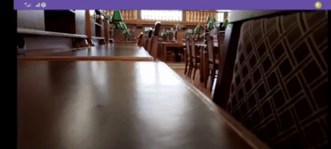

Приложение считывает картинку с камеры и обнаруживает на ней движущиеся предметы. 

Работает это так, что на основе определённого количества предыдущих сохранённых кадров создаётся маска, с которой сравнивается каждый следующий кадр.
Отличия помечаются определённым образом. В моём примере - жёлтым прямоугольником.

Чувствительность в данном примере слишком большая, поэтому помимо основного объекта считывается много его отражений и теней на других поверхностях.
